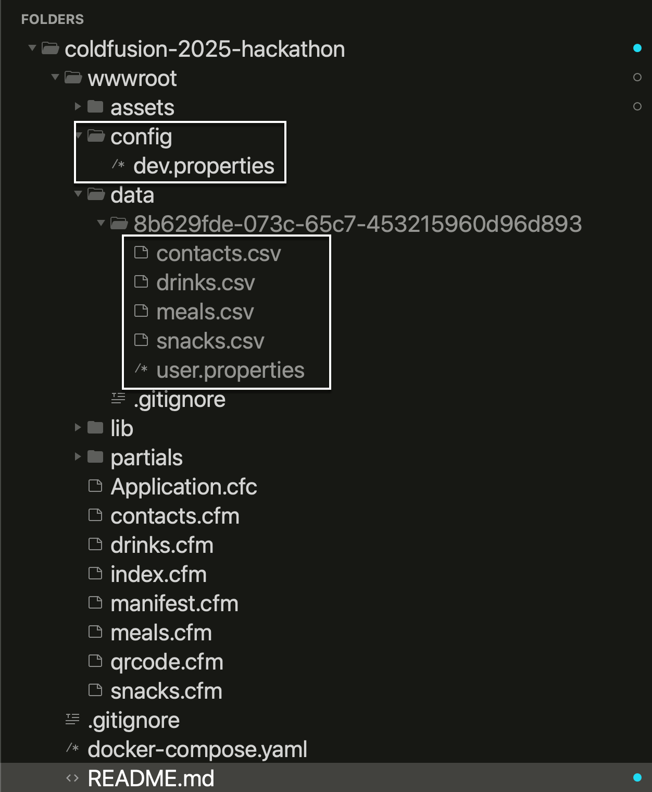

# Adobe ColdFusion 2025 Hackathon

by [Ben Nadel][ben-nadel]

This is the repository for my [Adobe ColdFusion (ACF) 2025 Hackathon][hackathon] submission. The primary goal of the hackathon is to _have fun_. The secondary goal of the hackathon is to showcase at least one of the features [newly available in the latest version of ACF][acf-new].

## Entry Restrictions

The hackathon took place from June 14-16, 2025 and had the following requirements:

* Application must run on Adobe ColdFusion 2025.
* Submissions must be self-contained and runnable (drop into `cfusion/wwwroot`).
* Any included libraries must be open source licensed.

## Hackathon: "Sitter Snacks"

We have a dog, Lucy. She's a geriatric Yorkie with extreme separation anxiety and a problematic bladder. As such, she has a lot of trouble being left on her own. So, when we go out, we hire a dog sitter to come and keep Lucy company while we're at the restaurant / movie / hike, etc.

Leading up to these outings, I go and get snacks for the sitter; and, if the outing overlaps with a meal, I'll ask her if she wants something more substantial like a pizza or a burger or something. As a hackathon idea, I thought it would be fun to create a small website where she can go and explicitly select the snacks that she wants (instead of me guessing); and then I can pick them up at the store on the day-of.

I'm calling this website "**Sitter Snacks**". It has one primary page experience, broken down into sections:

* Emergency contact information.
* Drinks.
* Snacks.
* Meals.
* QR Code.

Next to each entry within the drinks, snacks, and meals section is a toggle button that indicate the desire for that specific amenity. It's essentially a menu (in the restaurant sense) that the sitter is opting into:

Each of the sections has a separate configuration page that allows the line-items to be added, edited, and removed.

## ColdFusion 2025 Feature Exploration

Here are the ColdFusion 2025 features that I was trying to explore in this hackathon:

> **Aside**: keep in mind that my hackathon contains basically _no error handling_ and is _extremely light_ on any architecture. But, in a way, that's a feature of ColdFusion as well &mdash; that it can be as robust or as light-weight as you need it to be. The effort of the build is commensurate with the complexity of the application.

### CSV Files (`.csv`)

One of the biggest new features in ACF 2025 is the ability to read, write, and process CSV (Comma Separated Value) data. To explore this, I'm storing each user's contact info, drinks, snacks, and meal data in a set of CSV files contained within an UUID-based user-specific folder.

### Property Files (`.properties`)

ACF 2025 gives us the ability to create and consume [`.properties` files][wiki-properties]. A `.properties` files is a relatively simple collection of key-value pairs. I'm using this in two ways:

* Store configuration settings for the application itself.
* Store some metadata about the user who signed-up.

### JAR Paths

Another _very exciting_ (perhaps the _most exciting_) feature of ACF 2025 is the ability to provide a list of JAR paths to the `createObject()` call. Now, we can load custom Java libraries with better class-loader isolation. In this project, I'm using this to load the ZXing barcode library that I then use to render the shareable QR code at the bottom of the site.

### Content Security Policy (CSP)

Since this site is rendering user-generated content (UGC), security is a consideration. I've included the `this.enableCspNonceForScript` setting in my `Application.cfc`, which automatically injects a `Content-Security-Policy` HTTP header with a randomized nonce (n-once). Then, I'm using the new `getCspNonce()` function to apply this nonce to my script and link tags.

### Null Coalescing

In addition to "partially fixing" the Elvis Operator (no longer treating the empty-string as a falsy), ACF 2025 introduced the null coalescing operator (`??`). This works similarly to the Elvis Operator, but the right-hand expression is only used if the left-hand value is `null` / `undefined` (ie, the notions of truthy/falsy don't apply). I'm using this in a bunch of places when consuming data that may not be fully defined.

### Trailing Commas

ACF 2025 now allows trailing commas in a variety of places such as array and struct definitions. This really has no inherent application value other than developer experience (DX). Specifically, it allows `git diff` rendering and Pull Request (PR) rendering to be a little cleaner. This is really only relevant when working with other developers who are reviewing PRs. That said, I'm using it in a bunch of places in the hackathon.

## Road Bumps and Bugs

In addition to running out of time, and not getting to all the little features I wanted to explore, I also ran into some issues along the way.

* No Docker build for Apple M1/ARM silicon. I'm a MacBookPro 2022; and I was promised an M1 build in the second 2025 Beta release; but, apparently, this never made it into the roadmap. Thankfully, the good people over at [Ortus Solutions][ortus] provide an ARM build for all versions of ColdFusion.

* `this.enableCspNonceForScript` breaks `CFDump` / `writeDump()`. The way `CFDump` operates is that it renders both a `<style>` tag and a `<script>` tag in the page response. However, neither of these tags include the `getCspNonce()` functionality. So, your data is still dumped-out; but, it has no styling or interactivity.

   To get around this, I capture the output buffer, check for the substring, `table.cfdump_`, and if it exists, I override the CSP HTTP header to allow everything (essentially disabling the CSP).

* The CSP HTTP header that ColdFusion applies does not include any information about inline `<style>` tags. Which means, even if I apply a `getCspNonce()` to my `<style>` tag, the browser will still reject it. I'm using HTMX in this project for the toggle-buttons. And, to get around the CSP issue, I had to tell HTMX _not_ to inject loading-indicator styles.

* The `arrayOfStruct` format for CSV file generation is **completely broken**. The columns of the CSV are output in the order of the struct-key iteration (which is entirely unpredictable) instead of in the order of the `header` columns definition. To work around this, I map the data onto the the `arrayOfCFArray` format just before I call `csvWrite()`.

* ACF 2025 doesn't support unsigned integers. As such, when I use a value like `ffcccccc` to define the colors for the ZXing barcode, ACF complains that it can't fit it into an `int`. To get around this, I use the "two's complement", where I subtract `4294967296` from the value in order to translate it into an `int` range.

* The `writeDump()` function doesn't allow `var` to be passed-in as part of the `argumentCollection` mechanics. As such, in my `dump()` alias UDF (user defined function), I have to explicitly provide the `var` argument in addition to the `argumentCollection`.

* ACF 2025 still doesn't allow the `cfloop(collection)` to define both an `item` (value) and an `index` (key). You can do this with a `cfloop(array)`. As such, I have to calculate the `value` within the iteration body of a struct.

* ACF 2025 still doesn't allow `field[]` notation for collecting form field submissions as an array. As such, I have to polyfill this functionality in the `onRequestStart()` application life-cycle event handler.

And yet, I had a blast! 'Cause CFML is the cat's pajamas, yo!

---

This ColdFusion code was **99.99% human generated** (someone has to train the slop machines). I needed help from ChatGPT to figure out the two's complement issue for the `int` error. And, I used it to try and figure out the `getCspNonce()` bug for `<style>` tags.

----

Fun fact: the movie [Happy Gilmore][happy-gilmore] came out _13 years before_ my dog sitter as born. I'm officially old `:scream:`

[acf-new]: https://helpx.adobe.com/coldfusion/using/whats-new.html

[ben-nadel]: https://www.bennadel.com/

[hackathon]: https://adobe-cold-fusion-hackathon.meetus.adobeevents.com/

[happy-gilmore]: https://www.imdb.com/title/tt0116483/

[ortus]: https://www.ortussolutions.com/

[wiki-properties]: https://en.wikipedia.org/wiki/.properties
